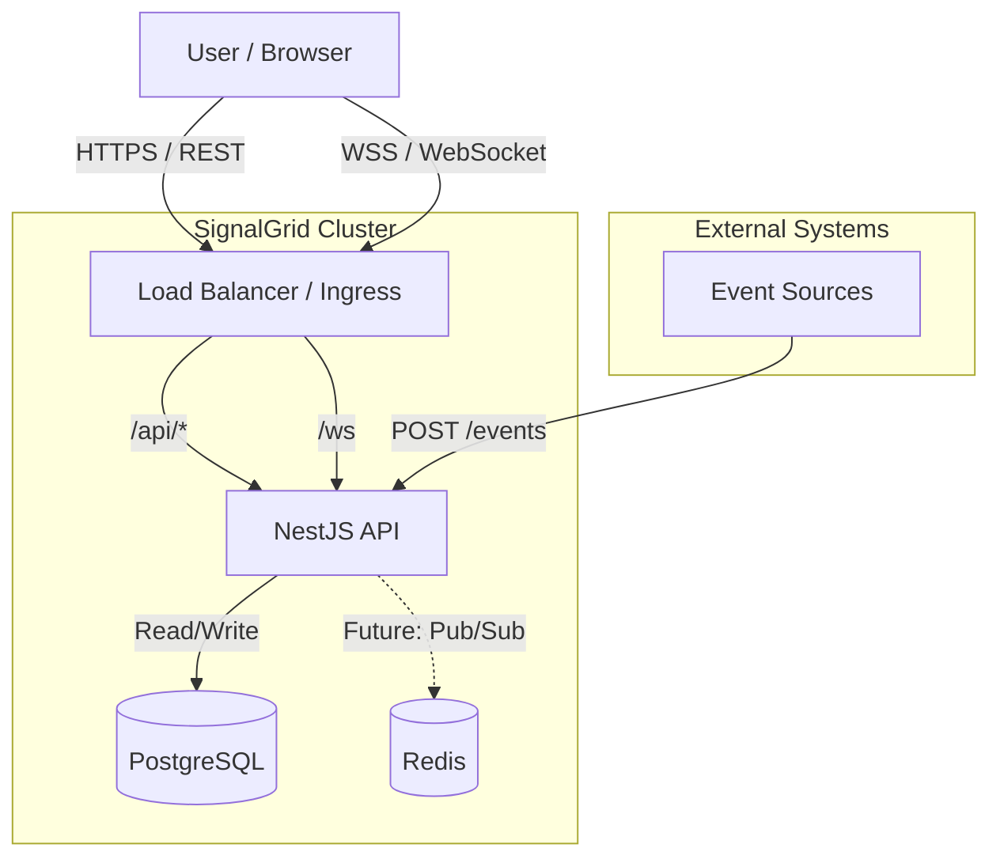
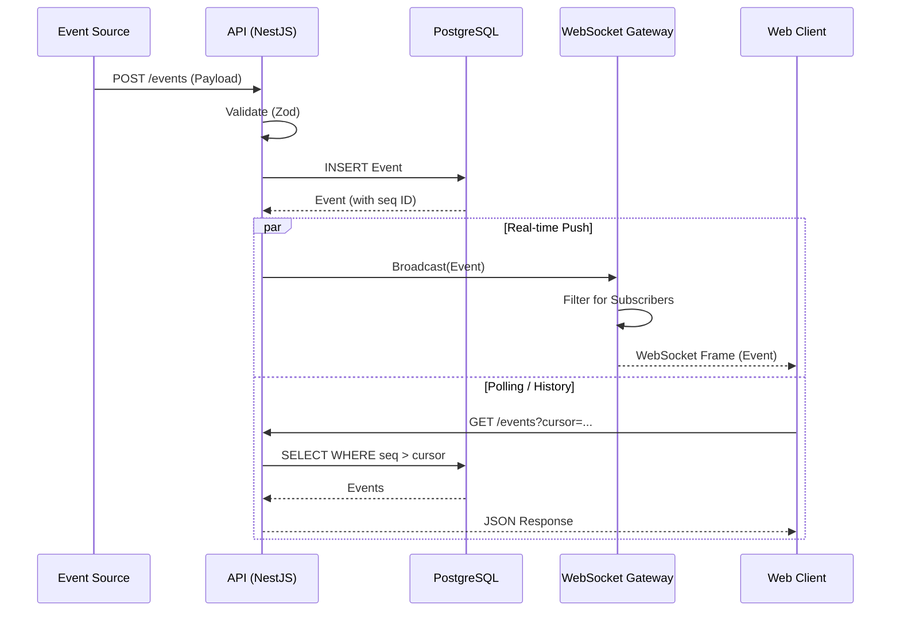

# Architecture Report: SignalGrid

This report provides a comprehensive analysis of the SignalGrid architecture, including system design, data flow, potential bottlenecks, and recommendations for improvement.

## 1. Executive Summary

SignalGrid is a real-time operations console built as a modern TypeScript monorepo. It leverages a **shared contracts** pattern to enforce type safety across the full stack (Frontend, Backend, and WebSocket streams).

*   **Strengths**: Strong type safety (Zod + TypeScript), clean monorepo structure (Turborepo), and a clear separation of concerns between API, SDK, and UI.
*   **Weaknesses**: The WebSocket implementation is stateful and difficult to scale horizontally. The authentication mechanism for refresh tokens is stateless, making revocation impossible without key rotation.
*   **Verdict**: Solid foundation for a V1 product, but requires architectural changes for high availability and scale.

---

## 2. System Architecture

### Context Diagram

### Data Flow: Event Ingestion & Streaming

---

## 3. Deep Dive & Analysis

### 3.1 Monorepo Structure (Turborepo)

The project uses `pnpm` workspaces with Turborepo, providing a robust development environment.

*   `apps/api`: NestJS application. Handles REST requests and WebSocket connections.
*   `apps/web`: Vue 3 application. Uses the SDK to communicate with the API.
*   `packages/contracts`: **Critical Component**. Contains Zod schemas that define the API shape. This ensures that the frontend and backend always agree on data structures.
*   `packages/sdk`: A typed client library that wraps `fetch` and `WebSocket`. It automatically validates responses against the contracts, providing runtime safety.

**Analysis**: This "Contract-First" approach is excellent. It prevents a class of bugs where the backend changes an API response but the frontend is not updated, as the SDK validation will fail loudly (or type-checking will fail at build time).

### 3.2 Backend (NestJS + Prisma)

*   **Framework**: NestJS provides a modular architecture.
*   **Database**: PostgreSQL with Prisma ORM.
*   **Data Model**:
    *   `Event`: The core entity. Uses `BigInt` for `seq` (sequence) to support cursor-based pagination.
    *   `Tenant`: Supports multi-tenancy.
    *   `User`: Standard authentication entity.
*   **API Layer**: Validation pipes use Zod schemas globally.

### 3.3 Real-time Infrastructure (WebSockets)

The WebSocket implementation (`events.gateway.ts`) is custom-built on top of the `ws` library (via NestJS adapter).

*   **Protocol**: A custom JSON-based framing protocol defined in `packages/contracts`.
*   **State**: Maintains a `Map<WebSocket, AuthenticatedClient>` in memory.
*   **Broadcasting**: Iterates through all connected clients to match filters and send events.

**Critique**:
*   **Scalability**: Because connection state is local to the node process, you cannot run multiple API instances behind a load balancer for WebSockets. If User A is connected to Instance 1 and User B to Instance 2, an event generated on Instance 1 will *only* be sent to users on Instance 1.
*   **Performance**: The broadcast loop is $O(N \times M)$ where $N$ is clients and $M$ is subscriptions per client. This will block the event loop under load.

### 3.4 Authentication

*   **Method**: JWT (Access Token) + HTTP-only Cookie (Refresh Token).
*   **Refresh Logic**: The `auth.service.ts` signs a JWT with `type: 'refresh'`.
*   **Security Issue**: The refresh token is **stateless**. It is not stored in the database.
    *   *Impact*: You cannot revoke a specific user's session without changing the global `JWT_SECRET` (which logs everyone out) or waiting for the token to expire (7 days). If an attacker steals a refresh token, they have persistent access.

---

## 4. Improvements & Mistakes

### Critical Mistakes (Must Fix)

1.  **Stateless Refresh Tokens**:
    *   *Problem*: Cannot revoke sessions.
    *   *Fix*: Store a hash of the refresh token (or a `sessionId`) in a database table (`RefreshToken`). Check this table during the `/auth/refresh` flow.

2.  **WebSocket Scalability**:
    *   *Problem*: In-memory client tracking prevents horizontal scaling.
    *   *Fix*: Implement a Pub/Sub mechanism (Redis) so that when an event is created on one instance, it is published to a channel. All API instances subscribe to this channel and broadcast to their local WebSocket clients.

### High Priority Improvements

1.  **Database Indexing**:
    *   The `Event` table has indices on `[tenantId, seq]`, which is good for cursor pagination.
    *   However, filtering by arbitrary fields in the `payload` JSONB column is not indexed and will be slow (`Table Scan`) as the dataset grows.
    *   *Recommendation*: Add a GIN index on `payload` if arbitrary filtering is required, or promote frequently queried fields to top-level columns.

2.  **Rate Limiting**:
    *   Throttler is configured (`app.module.ts`), but verify it applies to WebSocket connections. Standard NestJS `ThrottlerGuard` usually only protects HTTP routes.
    *   *Recommendation*: Implement a rate limiter specifically for WebSocket messages (e.g., limit `subscribe` or `ping` frames).

3.  **Error Handling in Broadcast**:
    *   The `broadcastEvent` method swallows errors for individual clients (`catch` block just logs). While this prevents crashing, it might hide network issues.
    *   *Recommendation*: Add metrics (Prometheus/OpenTelemetry) to track "failed broadcasts" or "slow clients".

### Code Quality & Maintenance

1.  **Schema Duplication**:
    *   Prisma schemas and Zod schemas in `packages/contracts` are manually synchronized.
    *   *Improvement*: Use a generator like `zod-prisma-types` to automatically generate Zod schemas from the Prisma schema, ensuring they never drift apart.

2.  **Testing**:
    *   The current test suite seems minimal.
    *   *Recommendation*: Add load tests (k6 or Artillery) to simulate thousands of concurrent WebSocket connections to identify the breaking point of the single-node broadcast loop.

---

## 5. Conclusion

SignalGrid's architecture is clean and modern, following best practices for type safety and code organization. The separation of concerns between the SDK and API is a highlight. However, the current implementation of WebSockets and Authentication limits it to a single-instance deployment. To support a production workload with high availability requirements, the introduction of Redis (for WS scaling) and stateful refresh tokens is essential.
